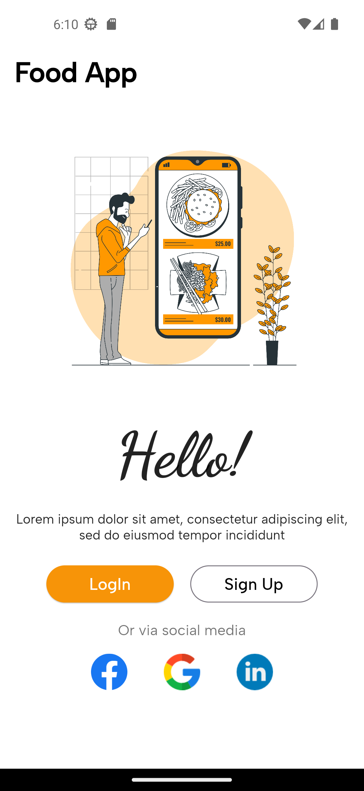
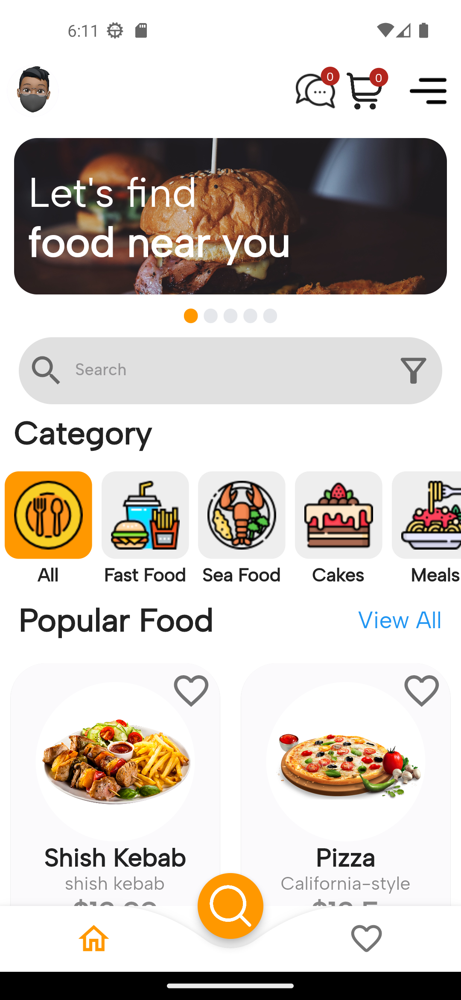

# Food App

The Food App is a Flutter-based mobile application designed to showcase a sample food ordering and delivery app. It allows users to browse through a variety of food items, view details, and add them to their cart. Although the app doesn't include order placement, payment integration, or order tracking features, it serves as a great starting point for developers interested in building their own food delivery applications using Flutter.

## Key Features

- User authentication system for secure login and profile management.
- Restaurant listings with menus, ratings, and reviews.
- Smooth and intuitive menu navigation.
- Cart management with item selection and quantity adjustments.
- Open-source project with a clean and modular codebase.

## Getting Started

To get started with the Food App project, follow these steps:

1. Clone the repository: `git clone https://github.com/MoeAlm/food_app.git`
2. Install Flutter and Dart on your development machine.
3. Run the app using a simulator or physical device.

## Contributing

Contributions to the Food App project are welcome. Feel free to open issues for bug reports or feature requests. If you'd like to contribute code, submit a pull request following the project's guidelines.

## License

Fell free to use it on your own!
For more details, explore the project on [GitHub](https://github.com/MoeAlm/food_app).

## Screenshots

*Caption for screenshot 1.*

*Caption for screenshot 2.*!

[Screenshot 3](assets/screenshots/Screenshot_1686240682.png)
*Caption for screenshot 3.*

---

**Note:** The Food App project does not include order placement, payment integration, or order tracking features.
